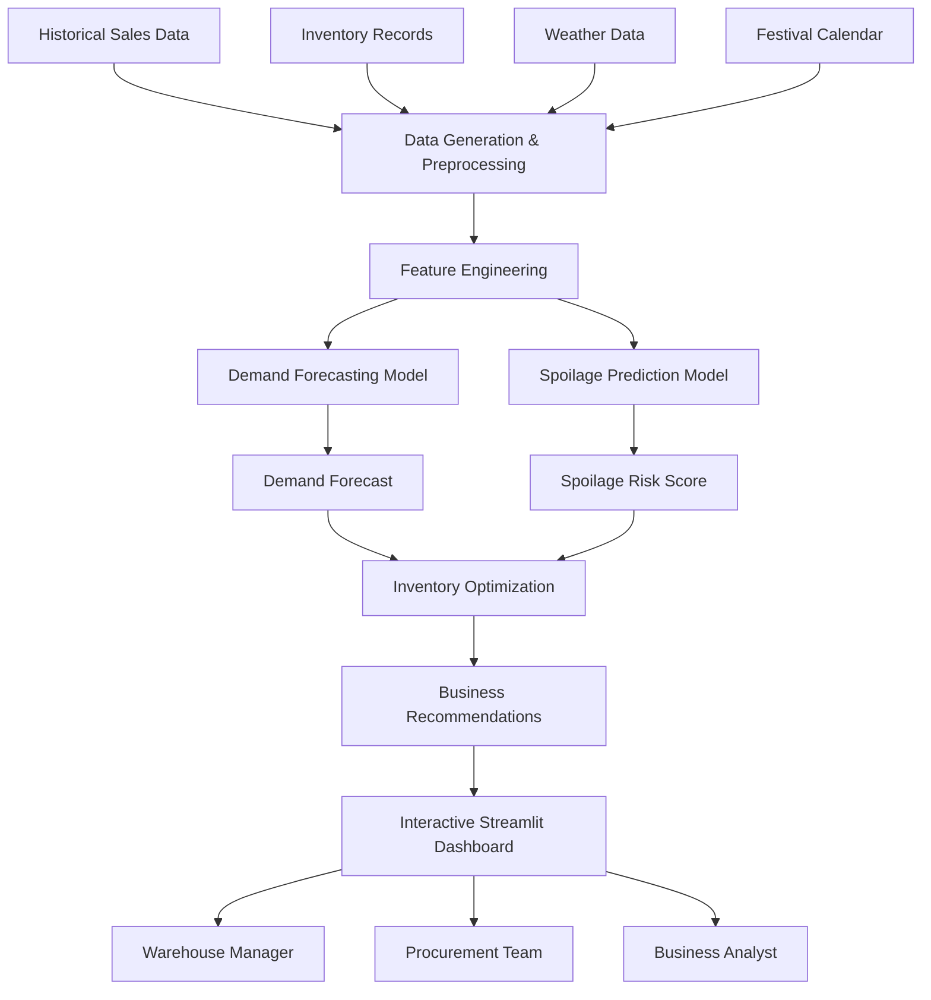

<div align="center">

# 🍅 PISA - Predictive Inventory & Spoilage Alert System

### *AI-Powered Demand Forecasting, Spoilage Prediction & Inventory Optimization for Perishable Supply Chains*

<p align="center">


</p>

*Transforming inventory data into intelligent business decisions using Machine Learning.*

</div>

---

# 📖 Overview

Managing inventory for perishable products is one of the biggest challenges in the food supply chain industry. Businesses dealing with fresh vegetables, dairy products, meat, poultry, and groceries must maintain the right inventory levels while minimizing wastage.

Traditional inventory planning often relies on historical averages or manual decision-making, making it difficult to respond to seasonal demand, weather changes, festivals, or sudden fluctuations in customer orders.

**PISA (Predictive Inventory & Spoilage Alert System)** is an AI-powered decision support platform designed to solve this problem. It combines demand forecasting, spoilage prediction, and inventory optimization into a single system that helps warehouse managers make smarter procurement and inventory decisions.

Instead of simply showing reports, PISA analyzes operational data and generates actionable recommendations that reduce food waste, improve product availability, and enhance overall warehouse efficiency.

---

# 💡 Why This Project?

Imagine managing a warehouse that supplies fresh ingredients to thousands of restaurants every day.

Every morning, warehouse managers must decide:

- How much inventory should be purchased?
- Which products are likely to spoil?
- Which inventory should be dispatched first?
- Which warehouse requires additional stock?
- How can we reduce wastage without causing stock shortages?

Making these decisions manually is challenging because inventory changes continuously, customer demand is uncertain, and perishable products have limited shelf lives.

A poor decision can either result in:

### 📦 Overstocking

Too much inventory remains unsold, leading to:

- Food wastage
- Higher storage costs
- Inventory write-offs
- Reduced profitability

or

### 📉 Understocking

Insufficient inventory causes:

- Stock shortages
- Lost sales
- Delayed deliveries
- Restaurant dissatisfaction

Finding the right balance between these two scenarios is the primary objective of modern inventory management.

---

# 🎯 Project Objective

PISA was developed to assist warehouse managers and procurement teams by providing AI-driven recommendations instead of relying solely on intuition or static reports.

The project aims to:

- Predict future product demand accurately.
- Identify inventory that is at high risk of spoilage.
- Recommend optimal procurement quantities.
- Reduce food wastage.
- Improve warehouse utilization.
- Support data-driven business decisions.
- Increase inventory turnover.
- Minimize operational costs.

---

# 🧠 How PISA Solves the Problem

PISA follows a complete decision-making pipeline rather than using a single machine learning model.

The system first analyzes historical sales patterns, inventory records, seasonal trends, weather conditions, and festival calendars to understand future demand.

Based on these insights, it predicts the expected demand for every product and warehouse.

Next, it evaluates the current inventory to identify products that are approaching the end of their shelf life or have a high probability of spoilage.

Finally, the forecasting results and spoilage predictions are combined to generate inventory recommendations, helping warehouse managers decide how much inventory should be purchased, retained, or dispatched.

Instead of replacing human decision-making, PISA acts as an intelligent assistant that provides accurate, explainable, and data-driven recommendations.

---

# 🌟 Key Features

- 📈 AI-based Demand Forecasting
- 🥬 Spoilage Risk Prediction
- 📦 Inventory Optimization
- 📊 Interactive Business Dashboard
- 📉 Real-time KPI Monitoring
- 📅 Festival & Seasonal Demand Analysis
- 🌦️ Weather-aware Forecasting
- 🧠 Explainable Machine Learning Insights
- 🚨 Early Spoilage Alerts
- 📋 Procurement Recommendations

---

# 🎯 Target Users

PISA is designed for professionals involved in supply chain and inventory management.

### 🏢 Warehouse Managers

Monitor inventory health, receive spoilage alerts, and optimize warehouse operations.

### 🛒 Procurement Teams

Plan purchases based on AI-generated demand forecasts and inventory recommendations.

### 📊 Business Analysts

Track operational KPIs, evaluate inventory performance, and identify opportunities for process improvement.

### 🍽️ Restaurant Supply Chains

Ensure consistent product availability while minimizing wastage across distribution centers.

---

# 🚀 What Makes PISA Different?

Unlike traditional inventory dashboards that only visualize historical data, PISA combines predictive analytics with business intelligence to support proactive decision-making.

Instead of answering:

> **"What happened?"**

PISA answers:

- **What is likely to happen next?**
- **Which products are at risk?**
- **How much inventory should be purchased?**
- **How can wastage be reduced?**
- **What actions should warehouse managers take today?**

This transforms raw operational data into practical business decisions.

---

# 📚 Table of Contents

- Overview
- Business Problem
- Solution Architecture
- Key Features
- Machine Learning Pipeline
- Project Structure
- Dashboard Overview
- Results & Business Impact
- Installation
- Usage
- Deployment
- Future Enhancements
- Author
- License

---
# 🚀 Our Solution

PISA (**Predictive Inventory & Spoilage Alert System**) is an AI-powered inventory intelligence platform that helps businesses manage perishable inventory more efficiently. Instead of relying on manual calculations or historical averages, PISA continuously analyzes operational data and provides intelligent recommendations to warehouse managers.

The system combines three major components:

1. **Demand Forecasting**
2. **Spoilage Prediction**
3. **Inventory Optimization**

Together, these components enable businesses to make proactive inventory decisions, reduce food wastage, and improve product availability.

---

# ⚙️ How PISA Works

The entire workflow can be divided into six major stages.

```text
Historical Sales
        │
Inventory Data
        │
Weather Data
        │
Festival Calendar
        ▼
───────────────────────────────
      Data Processing
───────────────────────────────
        ▼
Feature Engineering
        ▼
Demand Forecasting
        ▼
Spoilage Prediction
        ▼
Inventory Optimization
        ▼
Business Recommendations
        ▼
Interactive Dashboard
```

Each stage contributes to solving a specific business problem.

---

# 🗂 Step 1 - Data Collection

The first step is collecting operational data from multiple business sources.

PISA considers multiple factors instead of relying only on sales history.

The system uses:

- Historical sales records
- Current inventory levels
- Warehouse information
- Product shelf life
- Weather conditions
- Festival calendar
- Seasonal trends
- Product category
- Stock age

These features provide a complete picture of inventory behavior.

---

# 🧹 Step 2 - Data Preprocessing

Raw business data often contains inconsistencies, missing values, and duplicate records.

Before training the machine learning models, the data is cleaned and transformed.

Typical preprocessing includes:

- Removing duplicate records
- Handling missing values
- Feature encoding
- Date conversion
- Feature scaling (where required)
- Data validation

This ensures that the machine learning models receive reliable input data.

---

# 🧠 Step 3 - Feature Engineering

Feature engineering is one of the most important parts of the project.

Instead of using only sales values, PISA creates meaningful business features that improve prediction accuracy.

Some examples include:

### 📅 Time-based Features

- Day of Week
- Month
- Weekend Indicator
- Season
- Festival Flag

---

### 📦 Inventory Features

- Current Stock
- Remaining Shelf Life
- Product Age
- Inventory Turnover

---

### 🌦 Environmental Features

- Temperature
- Weather Conditions
- Seasonal Demand

---

### 📈 Historical Features

- Previous Day Sales
- Weekly Average Sales
- Rolling Demand
- Demand Trend

These engineered features allow the models to understand hidden business patterns instead of memorizing raw numbers.

---

# 📈 Engine 1 — Demand Forecasting

The first machine learning model predicts future customer demand.

### Objective

Estimate how much inventory will be required during the next business cycle.

Instead of asking

> "How much did we sell yesterday?"

the model predicts

> "How much are we likely to sell tomorrow?"

This enables procurement teams to purchase inventory before demand actually occurs.

### Model Used

Gradient Boosting Regressor

The model learns demand patterns from:

- Historical sales
- Weather
- Festivals
- Product category
- Seasonal changes

### Example

```
Tomatoes

Current Inventory

180 kg

Predicted Demand

250 kg

Action

Purchase Additional Stock
```

---

# 🥬 Engine 2 — Spoilage Prediction

Even with accurate forecasting, inventory already stored inside warehouses must still be monitored.

This module predicts which inventory lots are most likely to spoil before they can be sold.

The model evaluates:

- Product Age
- Shelf Life
- Storage Conditions
- Quantity Remaining
- Warehouse Temperature

Using these inputs, it calculates the spoilage probability.

### Model Used

Random Forest Classifier

### Example

```
Paneer

Shelf Life Remaining

1 Day

Spoilage Probability

94%

Priority

HIGH
```

Warehouse managers immediately know which products require urgent dispatch.

---

# 📦 Engine 3 — Inventory Optimization

The final stage converts predictions into business decisions.

Using the outputs of the forecasting and spoilage models, the optimization engine recommends how much inventory should be purchased.

Instead of guessing,

the system balances two competing costs:

- Overstocking Cost
- Understocking Cost

The recommendation minimizes total inventory cost while maintaining product availability.

### Example

```
Predicted Demand

240 kg

Current Stock

100 kg

Recommended Purchase

140 kg
```

This prevents unnecessary inventory accumulation while ensuring sufficient stock for customers.

---

# 🤖 Why Three Models?

Each machine learning model solves a different business problem.

| Model | Business Problem Solved |
|--------|-------------------------|
| Demand Forecasting | Predict future customer demand |
| Spoilage Prediction | Identify inventory likely to expire |
| Inventory Optimization | Recommend optimal purchase quantity |

Together, these models provide an end-to-end intelligent inventory management solution.

---

# 📊 Business Decision Pipeline

Traditional inventory systems typically answer:

- What happened yesterday?
- What is today's inventory?

PISA goes one step further by answering:

- What will customers demand tomorrow?
- Which inventory is likely to spoil?
- How much inventory should be purchased?
- Which products require immediate dispatch?
- How can wastage be minimized?

This transforms raw operational data into actionable business decisions.

---

# 🎯 Key Benefits

By integrating forecasting, spoilage prediction, and inventory optimization into one workflow, PISA helps organizations:

- Reduce food wastage
- Improve demand forecasting accuracy
- Minimize stockouts
- Increase warehouse efficiency
- Improve procurement planning
- Optimize inventory utilization
- Reduce operational costs
- Support data-driven decision making

Instead of reacting after inventory has already spoiled, businesses can take preventive actions based on AI-generated insights.

---
# 🏗️ System Architecture

PISA follows a modular architecture where each component is responsible for a specific stage of the inventory intelligence pipeline. This separation of concerns makes the project scalable, maintainable, and easy to extend.

The overall workflow starts with collecting historical business data, processing it into meaningful features, generating machine learning predictions, and finally presenting actionable insights through an interactive dashboard.



---

# 🔄 End-to-End Workflow

The system follows a complete Machine Learning pipeline rather than operating as individual prediction models.

### Step 1 – Data Generation

The project begins by generating realistic business data that simulates the operations of a perishable supply chain.

The generated dataset includes:

- Product information
- Warehouse details
- Daily demand
- Current inventory
- Shelf life
- Weather
- Festivals
- Seasonal demand patterns
- Spoilage information

This synthetic dataset mimics real-world warehouse operations while allowing experimentation without requiring confidential business data.

---

### Step 2 – Data Processing

Before training the models, the dataset undergoes preprocessing to ensure consistency and quality.

The preprocessing stage includes:

- Handling missing values
- Removing duplicate records
- Data validation
- Date formatting
- Feature preparation

This creates a clean dataset suitable for machine learning.

---

### Step 3 – Feature Engineering

Business data is transformed into predictive features that help the models identify hidden patterns.

Examples include:

| Feature Type | Examples |
|--------------|----------|
| Time Features | Day, Week, Month, Weekend |
| Inventory Features | Stock Level, Product Age, Shelf Life |
| Demand Features | Previous Sales, Rolling Average |
| Environmental Features | Weather, Temperature |
| Business Features | Festivals, Warehouse, Product Category |

These engineered features improve prediction accuracy by capturing relationships that raw data alone cannot represent.

---

### Step 4 – Machine Learning Predictions

The processed data is passed to the machine learning pipeline.

The pipeline consists of two predictive models:

- **Gradient Boosting Regressor** for demand forecasting.
- **Random Forest Classifier** for spoilage prediction.

Each model focuses on solving a different operational problem while sharing the same engineered feature set.

---

### Step 5 – Inventory Optimization

The outputs of both machine learning models are combined to generate business recommendations.

Instead of producing isolated predictions, PISA converts model outputs into practical decisions such as:

- Recommended purchase quantity
- Inventory dispatch priority
- High-risk spoilage alerts
- Stock replenishment planning

This makes the system useful for real operational environments rather than only for analytical purposes.

---

### Step 6 – Interactive Dashboard

The final results are presented through an interactive Streamlit dashboard.

Users can explore:

- Demand forecasts
- Spoilage predictions
- Inventory recommendations
- Business KPIs
- Warehouse performance
- Model evaluation metrics

This enables decision-makers to quickly understand warehouse health and take corrective actions.

---

# 📂 Project Structure

```text
PISA/
│
├── app.py
├── config.py
├── data_generator.py
├── ml_models.py
├── requirements.txt
├── README.md
│
├── assets/
│
├── data/
│
└── screenshots/
```

---

# 📁 Module Explanation

## 📌 app.py

This is the main entry point of the application.

Responsibilities:

- Launches the Streamlit dashboard.
- Loads generated datasets.
- Displays visualizations.
- Shows demand forecasts.
- Displays spoilage alerts.
- Presents inventory recommendations.
- Tracks business KPIs.

It acts as the presentation layer of the project.

---

## 📌 data_generator.py

This module creates realistic synthetic datasets that simulate daily warehouse operations.

The generated data includes:

- Historical demand
- Inventory levels
- Product information
- Weather effects
- Seasonal demand
- Festival influence
- Spoilage labels

Using synthetic data allows experimentation without relying on confidential business information.

---

## 📌 ml_models.py

This module contains the complete Machine Learning pipeline.

Implemented models include:

### Gradient Boosting Regressor

Predicts future product demand.

Input:

- Historical demand
- Seasonality
- Weather
- Festival information

Output:

- Forecasted demand

---

### Random Forest Classifier

Predicts the probability that inventory will spoil before being sold.

Input:

- Product age
- Shelf life
- Inventory quantity
- Warehouse conditions

Output:

- Spoilage probability

---

## 📌 config.py

Stores all project configurations and reusable constants.

Examples include:

- Product categories
- Warehouse configuration
- Shelf-life definitions
- Simulation parameters
- Dashboard settings

Separating configuration from business logic makes the project easier to maintain.

---

# ⚙️ Technology Stack

| Category | Technology |
|-----------|------------|
| Programming Language | Python |
| Dashboard | Streamlit |
| Machine Learning | Scikit-Learn |
| Data Processing | Pandas |
| Numerical Computing | NumPy |
| Visualization | Plotly |
| Version Control | Git & GitHub |

---

# 🔍 Why This Architecture?

The project follows a modular architecture because each component has a single responsibility.

### Benefits

- Easy to maintain
- Easy to test
- Scalable
- Reusable code
- Independent model development
- Cleaner project structure

For example, the demand forecasting model can be replaced with an LSTM or XGBoost model in the future without affecting the dashboard or spoilage prediction pipeline.

Similarly, new inventory optimization techniques can be integrated without modifying the forecasting models.

This modular design makes PISA suitable for future enhancements and production-scale deployment.

---

# 📊 Dashboard Overview

PISA provides an interactive dashboard built with **Streamlit** that transforms raw inventory data into meaningful business insights. Instead of manually analyzing spreadsheets or reports, users can monitor warehouse performance, identify potential risks, and make informed decisions through an intuitive interface.

The dashboard is designed for different stakeholders, including warehouse managers, procurement teams, and business analysts, allowing each user to quickly access the information relevant to their role.

---

# 🖥️ Dashboard Modules

The dashboard is divided into multiple modules, each addressing a specific business problem.

---

## 🏠 1. Executive Overview

The Executive Overview provides a high-level summary of warehouse operations and serves as the landing page of the application.

It displays key operational metrics such as:

- Total Inventory
- Active Products
- Warehouse Utilization
- Daily Demand
- Forecast Accuracy
- Spoilage Rate
- Inventory Turnover
- High-Risk Products

This enables decision-makers to understand the overall health of the supply chain without navigating through multiple reports.

> 📷 **Dashboard Screenshot**
>
> *(Add screenshot here after deployment)*
>
> `assets/screenshots/dashboard_overview.png`

---

## 📈 2. Demand Forecast Dashboard

This module visualizes predicted demand for every product.

Warehouse managers can compare:

- Historical Demand
- Forecasted Demand
- Seasonal Trends
- Festival Impact
- Demand Growth

The dashboard helps procurement teams understand how customer demand is expected to change over time.

### Example

| Product | Current Demand | Predicted Demand |
|----------|---------------:|-----------------:|
| Tomatoes | 180 kg | 245 kg |
| Paneer | 95 kg | 130 kg |
| Spinach | 60 kg | 82 kg |

---

## 🥬 3. Spoilage Alert Dashboard

The Spoilage Dashboard identifies products that are likely to expire before they can be sold.

Instead of waiting until inventory has already spoiled, warehouse managers receive early alerts and can prioritize dispatch.

The dashboard displays:

- Spoilage Probability
- Remaining Shelf Life
- Product Age
- Risk Category
- Recommended Action

### Example

| Product | Spoilage Risk | Status |
|----------|--------------:|--------|
| Spinach | 96% | 🔴 High |
| Paneer | 81% | 🟠 Medium |
| Tomatoes | 18% | 🟢 Low |

This allows managers to take corrective action before financial losses occur.

---

## 📦 4. Inventory Optimizer

This module recommends the ideal procurement quantity based on current stock levels and predicted demand.

Instead of simply showing inventory counts, the system answers:

- How much inventory should be purchased?
- Is the current stock sufficient?
- Should procurement be increased or reduced?

### Example Recommendation

| Product | Current Stock | Forecast | Suggested Purchase |
|----------|--------------:|---------:|-------------------:|
| Tomatoes | 180 kg | 250 kg | 70 kg |
| Paneer | 120 kg | 110 kg | 0 kg |
| Milk | 90 L | 150 L | 60 L |

These recommendations help maintain the right balance between inventory availability and wastage.

---

## 📊 5. Model Performance Dashboard

This section allows users to evaluate the performance of the machine learning models.

Metrics displayed include:

### Regression Model

- MAE (Mean Absolute Error)
- RMSE (Root Mean Square Error)
- R² Score

### Classification Model

- Accuracy
- Precision
- Recall
- F1 Score
- Confusion Matrix

This transparency helps users understand how reliable the predictions are before making business decisions.

---

# 📈 Business Impact

The primary objective of PISA is not only to generate accurate predictions but also to create measurable business value.

By combining forecasting, spoilage prediction, and inventory optimization, the system helps organizations improve operational efficiency and reduce unnecessary costs.

The expected business benefits include:

- 📉 Lower food wastage
- 📈 Higher demand forecasting accuracy
- 📦 Better inventory utilization
- 🚚 Reduced stock shortages
- 💰 Lower procurement costs
- ⚡ Faster operational decision-making
- 📊 Improved warehouse productivity

---

# 📊 Key Performance Indicators (KPIs)

PISA continuously tracks important business metrics that help measure the effectiveness of warehouse operations.

| KPI | Purpose |
|------|---------|
| Forecast Accuracy | Measures prediction quality |
| Spoilage Rate | Tracks inventory wastage |
| Inventory Turnover | Evaluates inventory efficiency |
| Fill Rate | Measures order fulfillment |
| Stockout Rate | Tracks product shortages |
| Warehouse Utilization | Monitors storage efficiency |

Monitoring these KPIs enables organizations to identify inefficiencies and continuously optimize their supply chain operations.

---

# 💼 Real-World Use Case

Imagine a warehouse receives **500 kg of tomatoes** every morning.

Without predictive analytics, procurement decisions are based primarily on historical averages.

If demand suddenly decreases due to bad weather or seasonal factors, a significant portion of the inventory may remain unsold and eventually spoil.

With PISA:

1. The Demand Forecasting model predicts lower customer demand.
2. The Spoilage Prediction model identifies batches that are at high risk.
3. The Inventory Optimizer recommends reducing the next procurement order.
4. The dashboard immediately alerts warehouse managers and procurement teams.

As a result:

- Less inventory is wasted.
- Procurement becomes more efficient.
- Restaurants continue receiving fresh products.
- Business costs are reduced.

This demonstrates how PISA transforms predictive analytics into practical operational decisions.

---

# 🎯 Project Highlights

✔ End-to-End Machine Learning Pipeline

✔ Interactive Business Dashboard

✔ Synthetic Supply Chain Data Generation

✔ Demand Forecasting using Gradient Boosting

✔ Spoilage Prediction using Random Forest

✔ Inventory Optimization Recommendations

✔ Business KPI Monitoring

✔ Modular and Scalable Architecture

✔ Industry-Inspired Case Study (Zomato Hyperpure)

✔ Production-Ready Streamlit Interface

---

# 🚀 Getting Started

This section explains how to set up and run the PISA application on your local machine.

## 📋 Prerequisites

Before running the project, ensure you have the following installed:

- Python 3.10 or above
- Git
- pip (Python Package Manager)
- Virtual Environment (recommended)

Verify your installation:

```bash
python --version
pip --version
git --version
```

---

# 📥 Installation

## 1️⃣ Clone the Repository

```bash
git clone https://github.com/your-username/PISA.git
```

Move into the project directory.

```bash
cd PISA
```

---

## 2️⃣ Create a Virtual Environment

### Windows

```bash
python -m venv venv

venv\Scripts\activate
```

### macOS / Linux

```bash
python3 -m venv venv

source venv/bin/activate
```

---

## 3️⃣ Install Dependencies

Install all required Python packages.

```bash
pip install -r requirements.txt
```

---

# ▶ Running the Application

Launch the Streamlit dashboard.

```bash
streamlit run app.py
```

The application will automatically open in your browser.

```
http://localhost:8501
```

---

# 📦 Project Dependencies

The project is built using the following libraries.

| Library | Purpose |
|----------|----------|
| Streamlit | Interactive Dashboard |
| Pandas | Data Manipulation |
| NumPy | Numerical Computation |
| Plotly | Interactive Visualizations |
| Scikit-Learn | Machine Learning Models |

Install them using

```bash
pip install -r requirements.txt
```

---

# 📂 Input Data

The project uses synthetic supply chain data generated within the application.

The generated dataset simulates:

- Daily sales
- Inventory levels
- Product categories
- Shelf life
- Warehouse information
- Seasonal demand
- Festival impact
- Weather conditions

This allows realistic experimentation without requiring confidential business data.

---

# ⚙ Configuration

Project configuration is managed through **config.py**.

It contains values such as:

- Warehouse settings
- Product categories
- Shelf life
- Seasonal parameters
- Demand simulation values
- Dashboard configuration

Updating these values automatically affects the simulation and dashboard.

---

# 🖥 Using the Dashboard

After launching the application, users can navigate through different dashboard sections.

### Executive Overview

Provides a summary of warehouse operations.

Displays:

- Total Inventory
- Daily Demand
- Warehouse Utilization
- Inventory Health

---

### Demand Forecast

Allows users to explore predicted demand for each product.

Users can:

- Select products
- Compare historical and forecasted demand
- Analyze seasonal trends

---

### Spoilage Alerts

Displays inventory lots at risk of spoilage.

Information includes:

- Product
- Shelf Life Remaining
- Risk Score
- Priority Level

---

### Inventory Optimizer

Provides AI-generated procurement recommendations.

Users can identify:

- Products to purchase
- Required quantity
- Overstock situations
- Understock situations

---

### Model Performance

Displays machine learning evaluation metrics.

Includes:

- Accuracy
- Precision
- Recall
- F1 Score
- MAE
- RMSE

---

# 💡 Example Workflow

A typical workflow using PISA is shown below.

```
Generate Data

        ↓

Train ML Models

        ↓

Predict Demand

        ↓

Predict Spoilage

        ↓

Optimize Inventory

        ↓

Generate Business Insights

        ↓

Visualize Results
```

This workflow enables businesses to move from raw operational data to actionable inventory recommendations.

---

# 🚀 Deployment

Although this project is designed to run locally, it can easily be deployed to cloud platforms.

Supported deployment platforms include:

- Streamlit Community Cloud
- Render
- Railway
- Docker
- AWS EC2
- Azure App Service
- Google Cloud Run

Deployment only requires:

- Source code
- requirements.txt
- Python environment

No additional configuration is necessary.

---

# 🔍 Possible Improvements

Future versions of PISA can include:

### 📡 Real-Time Data Integration

Connect directly to ERP or warehouse management systems.

---

### 🌦 Live Weather APIs

Replace simulated weather with live weather forecasts.

---

### 📈 Advanced Forecasting

Upgrade the forecasting engine using:

- XGBoost
- LightGBM
- Prophet
- LSTM
- Transformer-based forecasting models

---

### 📱 Mobile Dashboard

Allow warehouse managers to monitor inventory through a mobile application.

---

### 🔔 Smart Notifications

Send alerts through:

- Email
- SMS
- Slack
- Microsoft Teams
- WhatsApp

whenever spoilage risk exceeds a predefined threshold.

---

### 🤖 Explainable AI

Integrate SHAP or LIME to explain individual model predictions and improve stakeholder trust.

---

# 🏆 Learning Outcomes

This project demonstrates practical experience in:

- Machine Learning
- Data Analytics
- Product Thinking
- Supply Chain Analytics
- Inventory Optimization
- Business Intelligence
- Interactive Dashboard Development
- End-to-End ML Pipeline Design

Rather than focusing only on predictive models, PISA showcases how machine learning can be integrated into a real-world business workflow to support operational decision-making.

# 🛣️ Future Enhancements

PISA has been designed with a modular architecture, making it easy to extend and integrate with real-world supply chain systems. Some potential future improvements include:

### 📡 Real-Time ERP Integration
Connect the platform with Warehouse Management Systems (WMS) or ERP solutions such as SAP or Oracle to replace synthetic data with live inventory and sales information.

### 🌦️ Live Weather Integration
Use weather APIs (OpenWeatherMap or IMD APIs) to improve demand forecasting by incorporating real-time environmental conditions.

### 🤖 Advanced Machine Learning Models
Experiment with more advanced forecasting techniques such as:

- XGBoost
- LightGBM
- Facebook Prophet
- LSTM Networks
- Transformer-based Time Series Models

### 📱 Mobile Dashboard
Develop a mobile-friendly application to allow warehouse managers to monitor inventory and receive alerts on the go.

### 🔔 Smart Alert System
Automatically notify warehouse managers through:

- Email
- WhatsApp
- Slack
- Microsoft Teams

when inventory reaches critical levels or spoilage risk exceeds a predefined threshold.

### ☁ Cloud Deployment
Deploy the complete application using Docker and Kubernetes on cloud platforms such as AWS, Azure, or Google Cloud for scalability and production use.

---

# 📚 Key Takeaways

Through this project, the following concepts were implemented and explored:

- End-to-End Machine Learning Pipeline
- Demand Forecasting
- Spoilage Prediction
- Inventory Optimization
- Product Analytics
- Business Intelligence
- Feature Engineering
- Interactive Dashboard Development
- Synthetic Data Generation
- Data Visualization
- Decision Support Systems

More importantly, this project demonstrates how Machine Learning can be used to solve real business problems instead of being limited to predictive modeling.

---

# 🤝 Contributing

Contributions are always welcome!

If you would like to improve the project:

1. Fork the repository
2. Create a new feature branch

```bash
git checkout -b feature/new-feature
```

3. Commit your changes

```bash
git commit -m "Add new feature"
```

4. Push your branch

```bash
git push origin feature/new-feature
```

5. Open a Pull Request

Please ensure that your code follows clean coding practices and includes proper documentation where necessary.

---

# 📝 License

This project is licensed under the **MIT License**.

You are free to use, modify, and distribute this project for educational and research purposes.

---

# 👨‍💻 Author

## Satyam Kumar Jha

**B.Tech - Information Technology**  
Bhagwan Parshuram Institute of Technology (BPIT), New Delhi

### Connect with me

- **GitHub:** https://github.com/Jhas876622
- **LinkedIn:** *(Add your LinkedIn profile URL here)*
- **Email:** *(Add your professional email here)*

---

# 🙏 Acknowledgements

This project was inspired by the operational challenges of modern B2B food supply chains, particularly inventory management for perishable goods.

Special thanks to the open-source community and the developers behind:

- Python
- Streamlit
- Scikit-Learn
- Pandas
- NumPy
- Plotly

whose tools made this project possible.

---

# ⭐ Support

If you found this project useful or interesting, consider giving it a ⭐ on GitHub.

Your support helps improve the project and motivates future development.

---

<div align="center">

### 🍅 PISA — Predictive Inventory & Spoilage Alert System

**Building smarter supply chains with Machine Learning and Data-Driven Decision Making.**

⭐ Thank you for visiting this repository!

</div>
