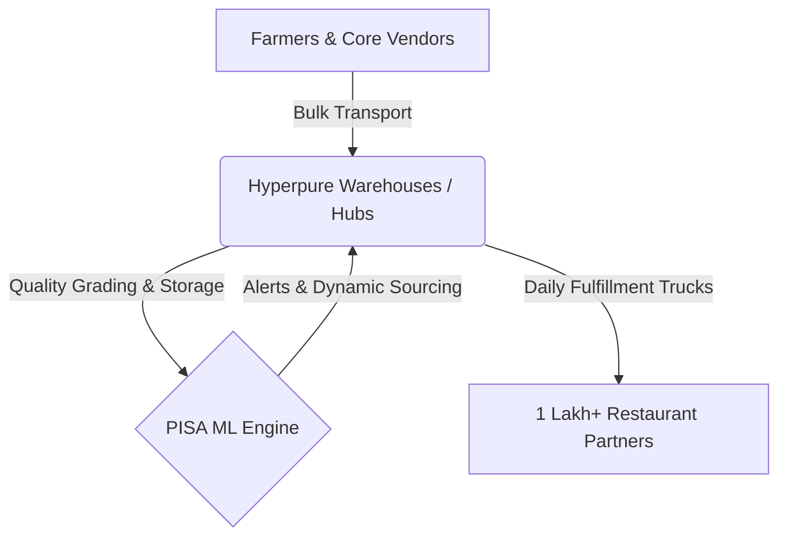

# 🍅 Case Study: Project PISA (Predictive Inventory & Spoilage Alert)
## Optimizing Zomato Hyperpure B2B Fresh Supply Chain & Reducing Perishable Wastage

---

## 1. Executive Summary & Business Impact

### The Zomato B2B (Hyperpure) Business Model
Zomato Hyperpure is Zomato’s B2B supply chain arm that acts as a **one-stop procurement platform** for restaurants. Unlike Zomato’s core consumer business (which is a 3P marketplace model), Hyperpure operates on a **1P (First-Party) inventory-led model**:
1. **Sourcing:** Hyperpure sources fresh vegetables, fruits, groceries, dairy, poultry, and meat directly from farmers, mills, and large-scale vendors.
2. **Warehousing:** Produce is transported to high-capacity fulfillment hubs (e.g., Delhi, Mumbai, Bangalore) where it is sorted, graded, stored, and packaged.
3. **Distribution:** Last-mile delivery trucks deliver these ingredients directly to restaurant partners daily.



### Why Perishable Wastage is a Critical Problem
In a 1P inventory-led supply chain, Zomato owns the inventory. This ownership structures the problem as follows:
* **Direct P&L Hit:** Every single kilogram of spoiled spinach, curd, or chicken breast represents a **100% write-off** of the cost of goods sold (COGS). It directly erodes Zomato's operating margins.
* **Low-Margin Industry Dynamics:** B2B grocery distribution runs on razor-thin EBITDA margins (typically 3–5%). A wastage rate of **4–6%** in perishables completely wipes out the profitability of those categories.
* **Operational Inefficiencies:** Spoiled items occupy temperature-controlled warehouse bins, create bio-hazards/cross-contamination risks, demand manual sorting labor, and increase disposal costs.
* **Stockouts vs. Spoilage Paradox:** If a warehouse manager under-orders to avoid spoilage, they cause stockouts, leading to restaurant dissatisfaction, lost revenue, and churn to local wholesale markets.

### Estimated Business Value of Solving Wastage
To contextualize this for an interview, let's look at the financial math of a typical Hyperpure warehouse hub:

| Operational Parameter | Baseline Metric | With PISA ML System (~35% Reduction) | Net Savings / Impact |
| :--- | :--- | :--- | :--- |
| **Monthly Fresh Sourcing Value** | ₹10,00,00,000 (~$1.2M) | ₹10,00,00,000 | Baseline Scale |
| **Average Perishable Wastage Rate**| **5.00%** | **3.25%** (Relative -35%) | **-1.75% absolute** |
| **Monthly Cost of Spoilage** | ₹50,00,000 | ₹32,50,00,000 | **₹17,50,000 saved / month** |
| **Annualized P&L Savings** | ₹6,00,00,000 | ₹3,90,00,000 | **₹2.1 Crore / year per hub** |
| **Fulfillment Guardrail (Fill Rate)**| 92.5% | **97.0%** (via dynamic safety stock) | **+4.5% Service Level Improvement** |

Across a network of **10 major fulfillment hubs**, implementing a predictive wastage reduction system unlocks **₹20+ Crores ($2.4M+) in direct annual EBITDA savings**.

---

## 2. User Personas & Pain Points

To design an effective solution, we must map the workflow of key actors in the supply chain:

### Persona 1: Zomato Warehouse Manager (e.g., "Rajesh")
* **Role:** Oversees daily warehouse operations, inventory space allocation, cold room maintenance, and local dispatching.
* **Core Goal:** Minimize stock write-offs while achieving a >95% daily dispatch fulfillment rate.
* **Key Pain Points:**
  * **Lack of Lot Visibility:** Receives tons of leafy vegetables daily but lacks a digital tool showing which exact pallet/lot came in first (FIFO violations) or which lot is decaying faster due to ambient temperature shifts.
  * **Reactive Firefighting:** Spoilage is discovered manually during packing. By then, the item is unsellable, leaving no time to liquidate the stock via discounts.
  * **Capacity Constraints:** Over-ordered stock clogs the cold room, leading to compromised storage spacing and accelerated decay.

### Persona 2: Category Sourcing Agent (e.g., "Ananya")
* **Role:** Manages vendor relationships, negotiates buying contracts, and places daily procurement orders with farmers/vendors.
* **Core Goal:** Secure high-quality produce at the lowest possible cost while aligning supply with warehouse requirements.
* **Key Pain Points:**
  * **Information Asymmetry:** Procurement decisions are based on gut feeling or simple 7-day moving averages, ignoring upcoming local festivals, long weekends, or rapid weather shifts.
  * **Supplier Quality Variance:** No structured log tracking which vendor's lots degrade faster once placed in storage, resulting in uniform procurement from unequal suppliers.

### Persona 3: Restaurant Owner / Chef (e.g., "Vikram" - Zomato B2B Client)
* **Role:** Runs a high-volume multi-cuisine restaurant relying on Hyperpure for daily ingredient delivery.
* **Core Goal:** Receive premium, fresh ingredients consistently by 7:00 AM to start kitchen prep.
* **Key Pain Points:**
  * **Stockouts:** Opening the Hyperpure app at night only to find "Spinach Out of Stock" or "Chicken Breast Out of Stock," forcing them to buy low-quality items from local markets at premium prices.
  * **Near-Expiry Deliveries:** Receiving tomatoes or paneer that spoil within 24 hours of delivery, increasing their own internal kitchen wastage.

---

## 3. The AI/ML Solution & Product Features: Project PISA

Project **PISA** (Predictive Inventory & Spoilage Alert) is a 3-engine system combining predictive classification, time-series demand forecasting, and stochastic inventory optimization:

```
┌────────────────────────────────────────────────────────┐
│                        PROJECT PISA                    │
├───────────────────┬───────────────────┬────────────────┤
│  1. Demand        │  2. Spoilage      │  3. Inventory  │
│     Forecast      │     Classifier    │     Optimizer  │
│  (GBM / LightGBM) │  (Random Forest)  │  (Newsvendor)  │
└─────────┬─────────┴─────────┬─────────┴────────┬───────┘
          │                   │                  │
          ▼                   ▼                  ▼
Forecasted Demand      Lot Risk Score     Optimal Order Qty
```

### Engine 1: Demand Forecasting (Gradient Boosting Regressor)
* **Objective:** Forecast the daily demand (in kilograms) for every SKU at every warehouse for the next 1-14 days.
* **Algorithm Choice:** **Gradient Boosting Regressor (GBM)** (e.g., `scikit-learn`'s `GradientBoostingRegressor`, scaling up to `LightGBM` or `XGBoost`).
  * *Why GBM?* Linear models (ARIMA) fail to capture non-linear variables like sudden heatwaves or compound festival multipliers (e.g., a festival falling on a long weekend). Gradient boosting handles tabular data with mixed lag features and calendar flags exceptionally well.
* **Key Features/Data Points:**
  * **Temporal Lags:** `lag_1`, `lag_2`, `lag_3`, `lag_7`, `lag_14` (prior daily demand values to capture short-term and weekly trends).
  * **Rolling Metrics:** 7-day and 14-day rolling demand averages and standard deviations (capturing base demand drift).
  * **Temporal/Calendar Features:** Day of week, month, day of year, weekend flag (`is_weekend`).
  * **Festival Calendar:** Active festival flags and their corresponding demand multipliers (e.g., Diwali = 2.5x demand, Holi = 2.0x demand).
  * **External Weather Data:** Temperature ($^\circ$C) and precipitation forecasts (rain dampens restaurant footfall; extreme heat drives demand for dairy products like curd).

### Engine 2: Spoilage Risk Classifier (Random Forest Classifier)
* **Objective:** Predict the binary probability (0 to 100%) of whether a specific lot currently sitting in the warehouse will spoil before being sold.
* **Algorithm Choice:** **Random Forest Classifier** with `class_weight="balanced"`.
  * *Why Random Forest?* Spoilage is highly non-linear and depends heavily on interaction terms (e.g., *high age* **AND** *high temperature deviation* = catastrophic risk). Random Forest handles these interactions naturally, does not require feature scaling, is robust to outlier lot quantities, and provides clear "Feature Importance" maps for operational debugging.
* **Key Features/Data Points:**
  * **Age Percentage (`age_pct`):** $\frac{\text{Current Age in Warehouse}}{\text{Base Shelf Life}}$.
  * **Temperature Deviation (`temp_deviation_c`):** Cumulative deviation of the lot's storage room from its ideal temperature (e.g., chicken stored at $6^\circ$C instead of $2^\circ$C).
  * **Over-Order Factor:** Ratio of current warehouse stock to the 3-day forecasted demand (high ratio indicates excess stock, increasing risk).
  * **Physical Attributes:** Lot quantity (kg), base category shelf life, and unit price per kg (expensive items receive prioritized alerts).
  * **Categorical Embeddings:** Target-encoded Category and Warehouse ID.

### Engine 3: Inventory Optimizer (Newsvendor Model)
* **Objective:** Recommend the exact replenishment order quantity (in kg) to category managers, balancing the cost of stockouts against the cost of spoilage.
* **Mathematical Framework:** **Newsvendor Formulation**.
  * **Cost of Overstocking ($C_o$):** 100% loss of the cost price if the lot spoils ($C_o = 1.0$).
  * **Cost of Understocking ($C_u$):** Estimated margin loss + customer trust damage if we stock out. Standard assumption: 25% ($C_u = 0.25$).
  * **Critical Ratio ($CR$):**
    $$CR = \frac{C_u}{C_u + C_o} = \frac{0.25}{0.25 + 1.00} = 0.20 \text{ (or 20th percentile)}$$
  * **Decision Rule:** The optimal stocking level is the 20th percentile of the forecasted demand distribution. This explicitly biases ordering toward caution for highly perishable, high-cost items (e.g., fish fillets) while stocking larger safety buffers for root vegetables with longer shelf lives.

---

## 4. Core Product Metrics (KPIs)

As a Product Analyst, you must track a balanced scorecard of business, operational, and technical metrics to measure the health of the system:

| Metric Type | Metric Name | Definition & Formula | Target / Benchmark |
| :--- | :--- | :--- | :--- |
| **North Star** | **Perishable Wastage %** | $\frac{\text{Value (₹) of spoiled perishables}}{\text{Total Value (₹) of perishables handled}}$ | **< 3.5%** (from 5% baseline) |
| **Guardrail** | **Stockout Rate (Unfilled Demand)** | $\frac{\text{Unfulfilled restaurant demand in kg}}{\text{Total ordered demand in kg}}$ | **< 3.0%** (ensures no customer starving) |
| **Operational** | **Inventory Turnover Ratio (ITR)** | $\frac{\text{Cost of Goods Sold (COGS)}}{\text{Average Inventory Value}}$ | **Higher is better** (> 35x annually) |
| **Model Health**| **Demand Forecast MAPE** | Mean Absolute Percentage Error of GBM demand prediction | **< 12.0%** overall SKU-level MAPE |
| **Model Health**| **Spoilage Classifier F1-Score**| Harmonic mean of Precision and Recall for Spoilage Class | **> 0.85** (minimizes false alarms) |
| **Business Impact**| **Net Wastage Cost Saved**| Baseline Wastage Cost minus Current Wastage Cost | **₹15 Lakhs+ saved / month per hub** |

---

## 5. Go-to-Market (GTM) & Implementation Strategy

To minimize operational risk in a live warehouse network, PISA is rolled out in four structured phases:

```
  Phase 1             Phase 2                 Phase 3                    Phase 4
  [Weeks 1-4]        [Weeks 5-12]            [Weeks 13-20]              [Weeks 21+]
  Data Logging  ───> Single-Hub MVP   ───>  Direct ERP Integration ───> IoT Cold-Chain &
  & Baselines        (Delhi - Leafy/Meat)   & Automated Sourcing        Dynamic Discounting
```

### Phase 1: Data Integration & Baseline Establishment (Weeks 1-4)
* **Goal:** Create clean data pipelines and establish baseline wastage logs without active algorithm control.
* **Actions:**
  * Install basic digital logging tools for warehouse incoming inspectors to tag every batch with a Lot ID, Arrival Timestamp, Supplier ID, and initial Quality Score.
  * Establish baseline measurements for category-level wastage and stockouts.

### Phase 2: Live Pilot / MVP (Weeks 5-12)
* **Goal:** Launch the prediction model in a single high-volume hub (e.g., Delhi North Hub) focusing only on high-risk categories (Leafy Vegetables and Meat & Poultry).
* **Actions:**
  * Deploy the **PISA Dashboard** featuring two active interfaces:
    1. **Live Spoilage Alert Table:** Displays active lots flagged by the Random Forest classifier (Red/Orange/Yellow zones based on remaining shelf life and temperature deviations) with a list of recommended actions.
    2. **14-day Demand Forecasting View:** Visualizes upcoming demand projections and confidence intervals.
  * Keep procurement manual but overlay PISA's recommendation as a tool tip.

### Phase 3: Closed-Loop Sourcing Integration (Weeks 13-20)
* **Goal:** Automate the sourcing pipeline by integrating the Newsvendor recommendation engine directly into Category Managers' ERP purchase orders.
* **Actions:**
  * The system auto-generates procurement quantities daily, requiring category manager approval only if a recommendation deviates by more than $\pm20\%$ from historical averages.
  * Roll out models to remaining product categories (Dairy, Root Vegetables) and warehouses (Mumbai and Bangalore hubs).

### Phase 4: Full Automation, Cold-Chain IoT, & B2B Dynamic Discounting (Weeks 21+)
* **Goal:** Shift from reactive mitigation to proactive demand-shaping.
* **Actions:**
  * **Dynamic Discounting Engine:** When the Spoilage Classifier flags a lot as "Yellow Alert" (40-60% shelf life left), the Hyperpure mobile app automatically triggers a 15-30% discount on that lot to B2B restaurants to accelerate sales.
  * **IoT Tracking:** Integrate Bluetooth/RFID temperature sensors in transit trucks to feed real-time cold-chain data directly into the Spoilage Classifier.

---

## 6. Edge Cases & Risks

Supply chains operate in chaotic environments. A resilient product design must incorporate mitigation plans for systemic shocks:

### Risk 1: Sudden Weather Shocks & Extreme Anomalies
* **Scenario:** Unseasonal heavy monsoons cause flash floods, destroying core farming clusters, spiking market procurement prices by 300%, and disrupting logistical routes.
* **Impact:** The Demand Forecast model sees high historical demand but actual incoming supply drops to zero, throwing off model predictions.
* **Mitigation:**
  * **System Override:** Implement a global "Supply Disruption Mode" toggle in the backend. When active, it automatically injects a manual safety stock buffer (e.g., +20% demand override) and ignores short-term pricing anomalies in the training set.
  * Incorporate real-time weather alerts via external APIs (e.g., Skymet, IMD) to dynamically downscale demand forecasts for rain-impacted days.

### Risk 2: Sensor Failures & Missing Cold-Chain Data
* **Scenario:** Refrigerator sensors in a warehouse compartment stop transmitting data, or a truck driver turns off the cooling container's telemetry device to save fuel.
* **Impact:** The Spoilage Risk Classifier receives null or frozen temperature inputs and falsely marks a compromised lot as "Safe" (Green).
* **Mitigation:**
  * **Imputation Logic:** If a sensor goes offline for $>30$ minutes, the pipeline imputes the temperature feature using the historical maximum temperature of that specific warehouse room.
  * **Data Integrity Flags:** Flag missing IoT data as a feature itself (`sensor_offline_flag = 1`). A high duration of offline status automatically triggers a manual physical inspection ticket.

### Risk 3: The "Cold Start" Problem for New SKUs / Warehouses
* **Scenario:** Hyperpure launches a new specialty cheese SKU or opens a new warehouse hub in Hyderabad. There is zero historical sales or temperature logs to build lag features.
* **Impact:** High forecast error and sub-optimal ordering, leading to immediate high spoilage.
* **Mitigation:**
  * **Hierarchical Forecasting:** Map new SKUs to their parent category (e.g., map "Artisanal Cheddar" to "Dairy - Cheese Slice") and copy the demand/seasonal profiles of similar items.
  * **Default Safe Parameters:** Run a conservative heuristic safety stock model for the first 30 days until the database records enough transactions to train a custom local model.

### Risk 4: Censored Demand Bias
* **Scenario:** The model forecasts a demand of 50 kg for Spinach, and procurement buys exactly 50 kg. Spinach sells out in 3 hours because actual demand was 80 kg. Because we only record actual sales, the model trains on 50 kg sales and continues to predict lower demand.
* **Impact:** The model gets locked into a sub-optimal downward demand loop (under-forecasting bias).
* **Mitigation:**
  * **Uncensor Demand:** Instead of using "sales volume" as the target variable, track **True Customer Demand** by logging search queries, cart additions, and clicks on out-of-stock items on the Hyperpure B2B app.
  * Add a margin safety factor to the Newsvendor model to test demand bounds periodically.
